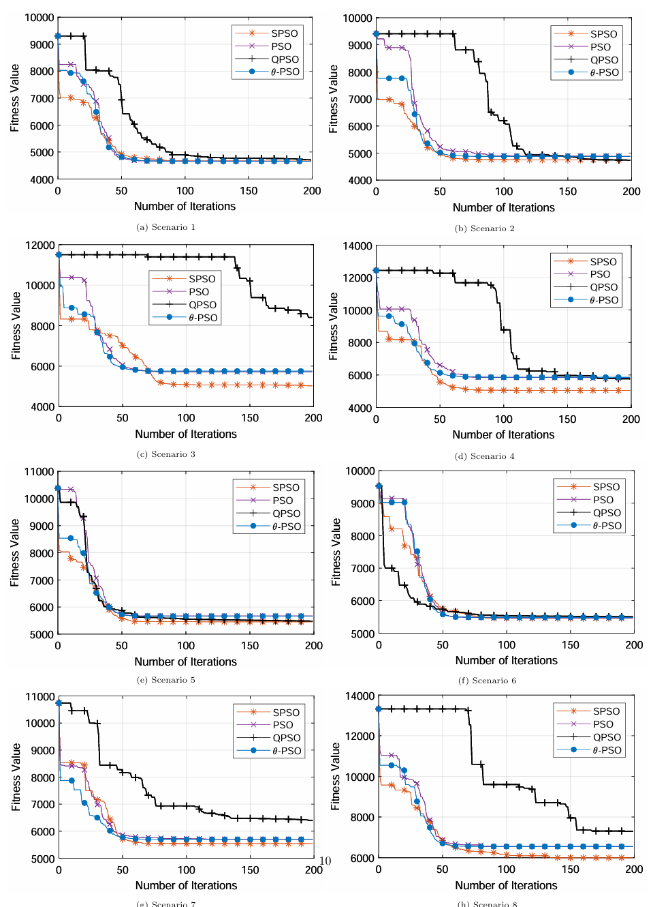
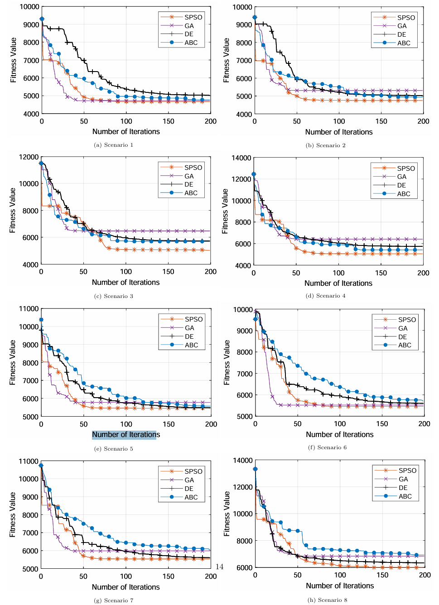
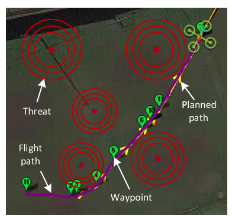
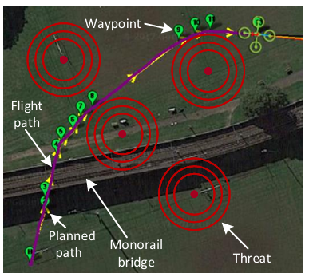
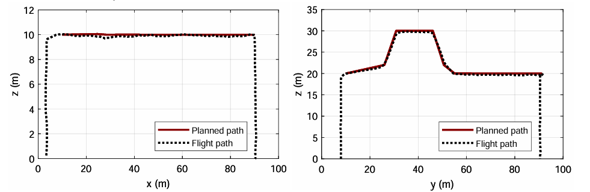

# 无人机路径可视化展示

## 1. 算法性能对比图表
### 1.1 收敛速度对比图

**SPSO与其他PSO变体（包括经典PSO、θ-PSO和QPSO）在不同复杂度场景下的收敛速度对比**:

- 横轴：迭代次数
- 纵轴：适应度值（成本函数值）
  

### 1.2 解质量对比表

**SPSO与其他PSO变体在8个测试场景中的平均适应度值和标准差，直观地展示了各算法的解质量和稳定性**:

| 场景 | SPSO (平均/标准差) | PSO (平均/标准差) | θ-PSO (平均/标准差) | QPSO (平均/标准差) |
| ---- | ------------------ | ----------------- | ------------------- | ------------------ |
|1	| 4683/104	| 4683/98	| 4643/50	| 4826/162|
|2	| 4699/94	| 5059/41	| 5006/69	| 5958/220|
|3	| 5486/38	| 5761/20	| 5766/32	| 7470/462|
|4	| 4994/28	| 5781/56	| 5794/46	| 7120/761|
|5	| 5441/27	| 5476/37	| 5518/37	| 5508/33|
|6	| 5362/59	| 5514/67	| 5486/45	| 5474/21|
|7	| 5778/94	| 5838/39	| 5800/43	| 5965/193|
|8	| 6006/63	| 6396/29	| 6368/46	| 8093/259|

从表中可以看出，SPSO在所有复杂场景（场景3、4、7和8）中均取得了最低的平均适应度值，并且标准差也显著低于其他算法。

### 1.3 算法稳定性对比图
**SPSO与其他PSO变体在不同测试场景下的标准差对比**:

从图中可以看出，SPSO在所有测试场景中均表现出较低的标准差。

## 2. 飞行路径可视化

### 2.1  飞行路径对比图

**SPSO算法生成的计划路径（黄色）与实际飞行路径（品红色）的对比**:

- 场景1：平坦地形飞行

实际飞行路径与计划路径高度重合，无人机成功避开了所有威胁区域，且飞行高度保持在预定范围内。

- 场景2：复杂地形飞行

从图中可以看出，无人机能够精确跟踪计划路径，成功飞越单轨桥。

### 2.2 飞行高度对比图

**该图表展示了场景1和场景2中计划路径与实际飞行路径的高度对比**:

- 横轴：飞行距离
- 纵轴：飞行高度
  
  从图中可以看出，实际飞行高度与计划高度高度一致。
