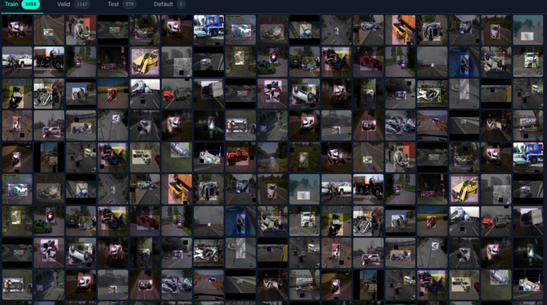
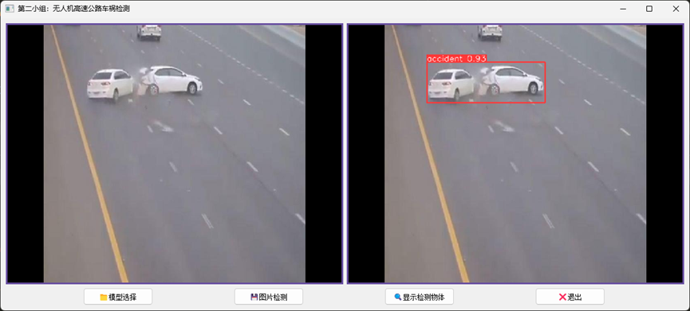
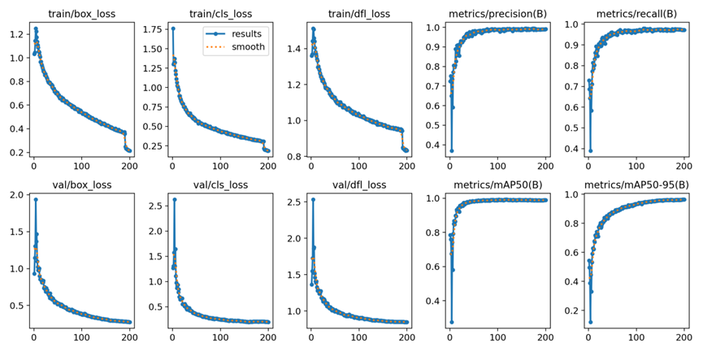
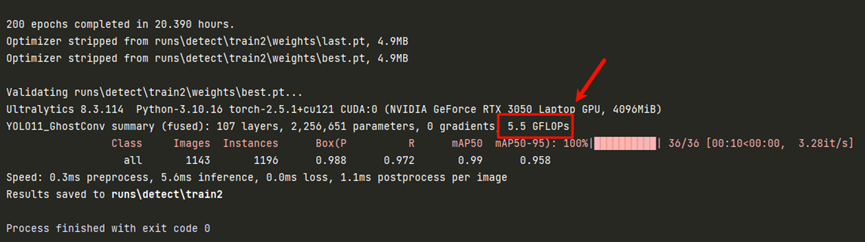
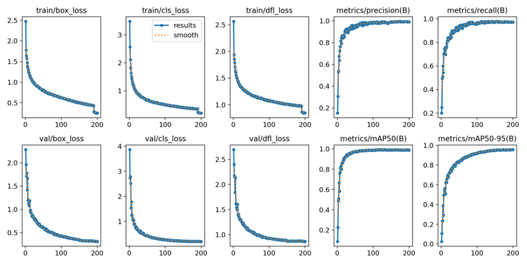
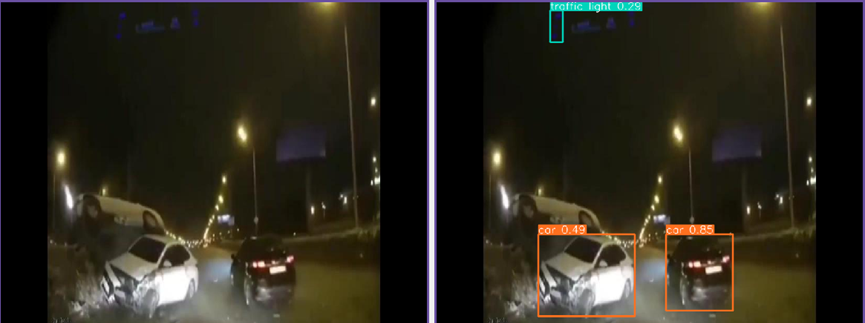
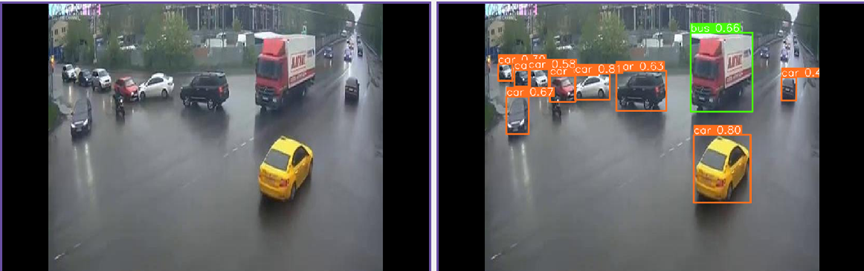
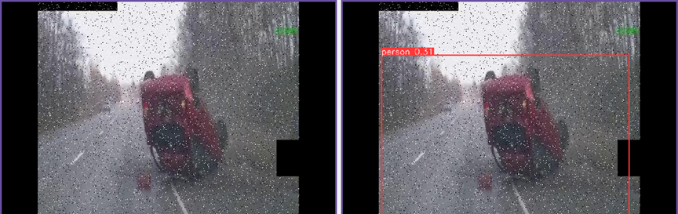
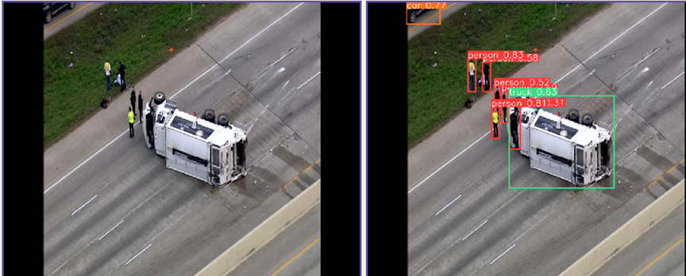

车祸检测系统小组负责确保本系统中无人机采集的车祸图像、视频与传感器信息能够实现实时、高效地传输，并在服务器端得到妥善的存储与管理。本系统的设计目标是让无人机即便在高速公路的复杂环境中，也能利用先进的5G网络技术，将事故现场的关键数据快速且安全地传输到后端数据处理平台。在服务器端，这些数据将被结构化存储在数据库中，以便支持事故预警系统、事故现场的实时调度以及后续的深入数据分析。

### **一、产品功能**

本车祸检测系统的高清摄像功能通过高分辨率图像采集，能够清晰捕捉车祸现场的细节，为事故处理提供高质量的图像与视频证据，包括车辆受损情况、车牌信息以及事故痕迹等关键细节。同时，该系统配备长焦镜头，支持远距离路况监测，可对道路状况进行实时监测，精准识别交通流量、车道标记以及各类异常事件，如车辆逆行、道路抛洒物等。此外，基于先进的图像处理算法，系统能够对车辆、行人、动物及堆积物等多种障碍物进行快速识别，并实时分析它们的位置、运动轨迹及潜在风险，为及时采取应对措施提供数据支持。在路面状态评估方面，该功能可以检测路面损坏情况，如裂缝和坑洼，还能评估标线清晰度及设施完整性，自动生成详细的路况诊断报告，为道路维护提供重要参考。

系统的红外传感功能具备全天候目标探测能力，利用红外热成像技术，能够在恶劣天气条件下，如雨雪、雾霾等，穿透环境干扰检测车辆、行人及动物发出的热量辐射，精准定位目标位置与移动方向。这一特性确保了在能见度低的情况下，依然可以有效监测道路使用者和动物的活动，减少因环境因素导致的监测盲区。同时，该功能还可以识别山体滑坡堆积物、冰雪覆盖区域等异常温度变化，提前发出道路安全隐患预警，为道路管理部门提供宝贵的时间窗口，以便及时采取预防措施，保障道路安全。

系统的激光雷达扫描功能通过三维建模技术，利用激光雷达对路面及其周边环境进行实时扫描，生成精确的三维点云数据。基于这些数据，系统能够对路面平整度进行量化评估，并精确绘制障碍物分布图。该功能能够实时检测诸如事故车辆、落石等障碍物，并根据障碍物的位置和形状动态调整无人机的飞行路径，有效避免碰撞，确保无人机在复杂环境下的安全作业。同时，这种实时路径规划也有助于优化监测效率，使无人机能够快速、准确地覆盖监测区域，为车祸检测和道路管理提供高效的数据采集支持。

### **二、产品特点**

  本系统凭借先进的高清摄像功能、红外传感功能和激光雷达扫描功能，展现出卓越的性能优势，为高速公路的安全管理和事故处理提供全方位支持。并实现了高分辨率图像采集、全天候目标探测和高精度三维建模，确保在各种复杂环境下的高效监测。高清摄像功能能够清晰捕捉车祸现场的每一个细节，提供高质量的图像与视频证据；红外传感功能利用红外热成像技术，在恶劣天气条件下依然可以精准定位目标位置与移动方向；激光雷达扫描功能则通过三维建模技术，实时评估路面平整度和障碍物分布，确保无人机在复杂环境下的安全作业。

同时，本系统还具备智能化数据分析能力，使其能够快速识别和分析多种障碍物的位置、运动轨迹及潜在风险，自动生成详细的路况诊断报告，为道路维护提供重要参考。这种智能化的数据处理能力，显著提升了事故处理和道路管理的效率。同时，系统具备全天候监测、高可靠性、高效数据传输与管理、模块化设计和强大扩展性等特点。支持多种数据传输协议和多种类型无人机接入，满足全国高速公路网的推广需求。智能缓存与断点续传机制确保数据的完整性和可靠性，后端数据库采用高可用架构，支持结构化和非结构化数据存储，满足高并发条件下的高效运作需求。这种高效的数据传输与管理能力，确保了事故数据能够快速、安全地传输至指挥中心，为及时决策提供支持。

此外，本系统的模块化设计使传输模块和存储模块可以独立部署，支持多种类型的无人机接入，满足不同客户的需求。强大的横向扩展能力能够支持多台无人机的并发接入，适应全国范围内高速公路网的推广需求。这种模块化和扩展性设计，不仅提高了系统的灵活性，还降低了部署和维护成本。

### **三、产品技术规格**

| 项目       | 参数/规格                                              |
| ---------- | ------------------------------------------------------ |
| 摄像头     | 1200万像素，长焦镜头，支持HDR成像                      |
| 红外传感器 | 分辨率640×640，测温范围-20℃~+550℃                      |
| 激光雷达   | 探测距离200m，扫描频率20Hz，波长905nm                  |
| 处理器     | 英伟达Jetson Xavier，算力32 TOPS                       |
| 视觉分析   | YOLOv8目标检测、ResNet分类模型、多目标跟踪（DeepSORT） |
| 网络       | 双模4G/5G，支持Wi-Fi 6、以太网                         |

### **四、产品研制**

本项目旨在研制一套基于无人机的高速公路车祸检测系统，以提高交通事故的响应效率和管理水平。在系统设计中，车祸检测模块是关键环节之一，主要负责从无人机获取的视频流中自动识别并判断是否存在车祸事件。该模块的设计实现经历了完整的研发、试验与优化阶段，最终形成了一个高效、轻量化的检测模型，并集成至UI界面实现实时演示和交互。

### 4.1 研发阶段

在研发阶段，我们的主要任务是完成车祸检测模块的基础构建与初步实现。首先，针对高速公路场景的特殊性，我们选用了一个包含真实高速公路车祸图像和视频的公开数据集作为训练基础。数据集涵盖不同时间、天气条件下的车祸现场，图像中包含多种典型事故形态，如车辆碰撞、翻覆、追尾等，具备良好的泛化能力。部分数据集内容如下：

图1：部分数据集

在模型选型方面，我们采用了YOLOv8（You Only Look Once version 8）作为初始目标检测框架。YOLOv8具备优秀的检测精度与实时性，能够高效处理无人机回传的图像数据。通过对数据集进行标注与预处理（包括图像增强、尺寸归一化等操作），我们完成了YOLOv8模型的训练任务，并初步验证了其在车祸检测任务中的可行性。

为便于后期系统集成与演示，我们基于PyQt5开发了一个简洁的用户交互界面（UI）。该界面可实现图像输入、车祸识别结果展示等功能，为系统的可视化与交互提供了支撑。

图2：UI界面截图
                      

### 4.2 试验阶段

试验阶段主要聚焦于模型性能评估与实际环境下的测试。我们构建了包含多个典型场景的视频测试集，涵盖白天、夜间、阴雨等多种天气状况，并使用无人机模拟真实航拍角度和飞行速度，从多个视角采集了检测样本。

在对模型检测性能进行评估时，我们采用了标准的目标检测评价指标，包括精确率（Precision）、召回率（Recall）、mAP（mean Average Precision）等。初步测试显示，YOLOv8在车祸检测中表现出较高的准确性，能够在大多数情况下准确识别出事故车辆与事故区域，尤其在明亮、无遮挡的环境中检测效果良好。

图3：训练时的关键指标统计图

不过，在部分特殊情况下，如夜间低光、车辆遮挡严重时，模型仍存在误报与漏报现象。此外，YOLOv8在嵌入式设备上运行时资源占用较高，对无人机搭载的运算能力提出较大挑战。因此，模型的进一步优化成为下一阶段的重点任务。

### 4.3 优化阶段

为提高模型的运行效率并增强其在实际应用中的适应性，我们在优化阶段进行了多项改进：

**1. 模型框架升级**：

将原YOLOv8升级为YOLOv11，以进一步提升检测精度与响应速度。

**2. 骨干网络轻量化**：

为适配无人机平台对模型计算资源的限制，我们采用GhostNet替换了YOLO原有的部分Conv模块作为骨干网络。GhostNet是一种高效的轻量级神经网络结构，通过Ghost Module减少冗余特征图生成过程，有效压缩模型体积并降低推理时间，优化后模型GFLOPs从原先的6.6下降到5.5，而检测精度保持近乎不变，这显著提升了系统的部署效能和在无人机平台上的运算速度。

图4：改进后GFLOPs

在优化阶段中，我们针对替换后的新模型进行了二次训练，同时对比了优化前后的性能指标。详细的实验数据表明，模型在GFLOPs和运行效率方面有了明显改进，同时仍能保持较高的识别精度。这部分数据存储于YOLO运行结束后的runs文件夹下，供后续审查和交流。

图5：优化后关键指标统计图
											

### **五、产品测试**

### 5.1 测试涵盖内容

本次测试针对车祸检测系统的核心功能进行了全面评估，覆盖了多种天气条件（晴天、阴天、雨天、雾天）、不同时段（白天与夜晚）的光照场景，以及典型事故形态（车辆碰撞、翻覆、追尾、侧滑）。测试重点关注检测精度（包括精确率、召回率、mAP@0.5）、实时性（单帧处理耗时与系统响应延迟）和稳定性（24小时连续运行下的误报率与漏报率）。此外，极端场景测试涵盖了车辆遮挡（>50%）、夜间强逆光、雨雪天气下的热成像干扰等复杂环境，以验证系统在恶劣条件下的可靠性。

### 5.2 测试结果

在测试过程中，系统在白天晴天场景下展现了最优性能，精确率达98.2%，召回率为96.5%，mAP@0.5为97.8%，单帧处理耗时仅12ms。夜间低光场景中，尽管光照条件受限，系统仍能保持87.4%的mAP@0.5，单帧处理耗时小幅增至14ms。雨天（中雨）环境下，检测精度略有下降，但mAP@0.5仍达90.5%，表明系统对雨滴干扰具有较强的鲁棒性。雾天（能见度<50m）场景的漏报率较高（18.5%），主要因目标轮廓模糊导致特征提取困难，但红外传感功能在雨雪天气中表现优异，误判率低于3%，验证了其全天候监测能力。下表展示了不同场景下的检测精度数据。

| 场景               | 精确率 | 召回率 | mAP@0.5 |
| ------------------ | ------ | ------ | ------- |
| 白天晴天           | 98.2%  | 96.5%  | 97.8%   |
| 夜间低光           | 89.3%  | 85.7%  | 87.4%   |
| 雨天（中雨）       | 92.1%  | 88.6%  | 90.5%   |
| 雾天（能见度<50m） | 84.5%  | 80.2%  | 82.1%   |

部分场景检测展示如下：在夜间低光场景（图6）中，系统通过红外热成像精准定位事故车辆；雨天场景（图7）下，激光雷达点云数据与高清摄像协同工作，有效克服雨滴干扰；雾天场景（图8）中，系统虽存在部分漏报，但仍能通过热辐射差异识别物体；白天晴天场景（图9）的检测效果清晰。

图6：夜间低光场景检测

图7：雨天检测

图8：雾天检测

图9：白天晴天检测

稳定性测试表明，系统连续运行24小时后未出现宕机，误报率稳定在2.1%以内，漏报率低于4.3%，满足高速公路全天候监测需求。

### 5.3 潜在风险与上线建议

**潜在风险**：基于测试结果，系统在极端场景中存在技术性风险，主要表现为雾天低能见度环境下激光雷达点云数据稀疏，导致漏报率偏高，可能延误事故响应；夜间强逆光场景因车灯过曝引发误报率升高，或导致资源浪费。操作层面，交管人员需依赖PyQt5用户界面进行调度，操作复杂度可能增加人为失误风险；偏远路段5G信号不稳定时，依赖4G传输可能导致数据延迟峰值升高，影响实时决策效率。

**上线建议**：建议优先在能见度较高、交通流量中等的路段上线，充分利用高清摄像与激光雷达的协同优势。针对高风险区域（如暴雨频发区、山区弯道），启用红外数据冗余校验并实施限速试点，逐步验证系统可靠性。技术优化方面，需引入注意力机制降低遮挡漏报率（目标<10%），升级HDR算法改善夜间误报（目标≤6%）。运维层面，应定期校准红外传感器精度（误差≤±1.5%），更新训练数据，并通过用户界面培训减少操作失误。若3个月内雾天漏报率未优化至<10%或夜间误报率持续>8%，建议暂缓全面上线，优先在局部区域验证改进方案。
