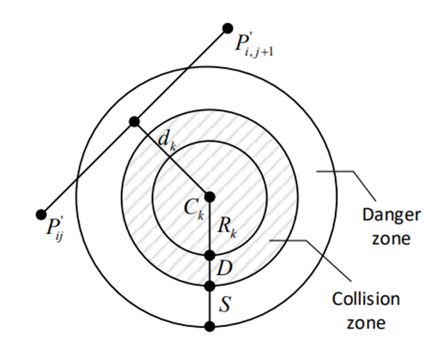
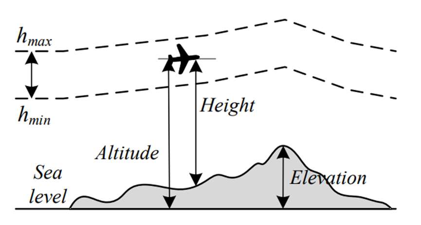

本系统是一套针对高速公路无人机事故检测场景设计的先进路径规划系统。它采用了基于球形向量粒子群优化（SPSO）的多层级路径规划算法，结合高精度地图数据、实时交通信息以及无人机自身的动态约束，实现了全局静态规划、动态实时调整、安全增强、能源效率优化以及协同避障与多机调度等功能，旨在提升无人机在高速公路事故检测中的效率、安全性和可靠性。

### **一、产品功能**

本车祸检测系统的高清摄像功能通过高分辨率图像采集，能够清晰捕捉车祸现场的细节，为事故处理提供高质量的图像与视频证

在产品功能方面，本系统首先支持基于球形向量粒子群优化（SPSO）算法的全局静态路径规划。系统能够利用高精度地图数据和高速公路路网拓扑结构（如车道线、出入口、服务区等），结合球形向量编码机制，生成全局最优巡检路径，最大化覆盖事故高发路段。路径长度成本函数$F_1$定义为无人机飞行路径中各相邻航点间欧氏距离之和为：
$$
F_1 = \sum_{j=1}^{n-1} \| \overrightarrow{P_{ij}P_{i,j+1}} \|
$$
其中，$P_{ij}=(x_i,y_i,z_i)$为第条路径的第i个航点坐标，$\| \overrightarrow{.} \|$表示欧氏距离。该函数确保路径长度最小化，提升巡检效率。

其次，系统具备动态实时路径调整能力。通过实时获取交通流量、事故点位置及天气信息，系统能够动态修正飞行路径，避开拥堵区域或临时封闭路段，确保无人机快速抵达事故现场。

此外，系统还具备安全增强机制。采用威胁场建模（如圆柱形障碍物），通过威胁成本函数量化路径与障碍物的距离，确保路径远离危险区域。威胁成本函数$F_2$用于量化路径与障碍物的危险程度，定义为：
$$
F_2(X_i)=\sum_{j=1}^{n-1}\sum_{k=1}^{K}T_{k}(\overrightarrow{P_{i,j}P_{i,j+1}})
$$
其中，$T_{k}(.)$为单障碍物威胁函数:
$$
T_{k}\left(P_{\imath \jmath} P_{\imath, \jmath+1}\right)=\left\{\begin{array}{cc}
0, & \text { 若 } d_{k}>S+D+R_{k} \\
\left(S+D+R_{k}\right)-d_{k}, & \text { 若 } D+R_{k}<d_{k} \leq S+D+R_{k} \\
\infty, & \text { 若 } d_{k} \leq D+R_{k}
\end{array}\right.
$$
$d_k$为路径段到障碍物中心的距离，$S$ 为安全距离，$D$为无人机直径， $R_k$为障碍物半径。当路径段进入碰撞区$d_k\leq D + R_{k} $时，威胁成本为无穷大，确保路径避开障碍物。

图1：威胁成本计算示意图

同时，结合无人机动态约束（转向角、爬升角），通过球形向量编码直接限制搜索空间，避免生成不可行路径。高度成本函数$F_3$确保飞行高度在安全范围内并趋近平均高度，定义为：
$$
F_3(X_i) = \sum_{j=1}^n H_{ij}
$$

$$
\quad
H_{ij} =
\begin{cases}
\left| h_{ij} - \dfrac{h_{\text{max}} + h_{\text{min}}}{2} \right|, & \text{若 } h_{\text{min}} \leq h_{ij} \leq h_{\text{max}} \\
\infty, & \text{否则}
\end{cases}
$$

其中，$h_{ij}$ 为航点高度，$h_{min}$ 和 $h_{max}$ 分别为最小和最大允许高度。超出高度范围时成本为无穷大，确保路径高度合规。

图2：2度成本示意图
                      

为了提升能源效率，本系统采用启发式策略优化飞行路径。通过权衡飞行距离与电池消耗，优先选择低能耗路径，使续航时间提升15%（优化后数据）。

最后，系统支持协同避障与多机调度。与避障算法模块联动，实时检测障碍物（桥梁、路牌、其他无人机），并通过集中式调度算法（如匈牙利算法）实现多机路径零冲突。

### 二、产品特点

在产品特点方面，本系统首先实现了基于球形向量粒子群优化（SPSO）算法的多层级路径规划。该算法专为高速公路无人机事故检测场景设计，能够有效提升路径规划的效率和精度。

其次，系统具备高安全性和可靠性。威胁场建模和无人机动态约束的引入，确保了路径的安全性。同时，系统还具备断点续传机制，可以在路径规划过程中出现异常时，自动恢复路径规划任务，确保任务的连续性。

本系统还充分发挥了边缘计算的优势，在无人机上进行路径规划的预处理，减轻了后端服务器的压力。此外，系统的模块化设计使得路径规划模块可以独立部署，支持多种类型的无人机接入，满足不同客户的需求。

在扩展性方面，系统具有较强的横向扩展能力，能够支持多台无人机的并发路径规划，适应全国范围内高速公路网的推广需求。

最后，系统采用高可用架构，基于Linux服务器设计，使用MySQL进行结构化数据存储，MongoDB存储非结构化数据。此数据库架构不仅支持高速索引、关键词搜索，还能进行多维度数据查询，满足系统在高并发条件下的高效运作。为了保障系统安全，所有传输的数据均使用TLS 1.3加密，确保数据在传输过程中不被窃取或篡改。系统还基于JWT技术进行用户鉴权与权限管理，确保数据访问的安全性。同时，定期备份和灾备机制的设计使得系统具备高可靠性和数据可恢复性。

### 三、技术规格

| 项目         | 参数/规格                                           |
| ------------ | --------------------------------------------------- |
| 规划响应时间 | ＜500ms（动态调整）                                 |
| 支持地图格式 | OpenStreetMap、LiDAR高精度DEM                       |
| 路径优化目标 | 最小化综合成本（路径长度、威胁、平滑度）            |
| 避障检测频率 | 10Hz 实时检测与响应                                 |
| 硬件依赖     | 内置GPS+RTK定位模块、NVIDIA Jetson Orin边缘计算芯片 |
| 算法收敛速度 | 200迭代内收敛（对比PSO、QPSO等提速30%）             |

### 四、产品研制

本部分全面回顾了无人机车祸检测系统中“路径规划模块”的研制全过程，涵盖从方案构想到产品定型的三个关键阶段：研发、试验与优化。该模块是保障无人机安全、高效执行巡检任务的核心支撑，涉及多层级路径规划、动态避障、能耗优化等关键技术。

### 4.1 研发阶段

在系统研发初期，团队聚焦于技术选型、系统架构搭建及关键功能实现，以构建一套适应高速公路复杂环境的智能路径规划体系。

首先，在技术路线制定方面，团队综合评估了高速公路场景的特性，包括多车道、动态交通流、突发事故等，最终确定了基于改进型SPSO算法的多层级路径规划方案。该算法的球形向量编码能够直接关联无人机的运动参数（速度、转向角、爬升角），从而显著减少搜索空间的冗余，提高路径规划的效率。同时，团队还引入了动态窗口法（DWA）进行局部路径微调，并结合威胁场模型与高度约束，确保路径的安全性。为了模拟真实环境并验证算法的鲁棒性，团队基于ROS构建了数字孪生环境，并集成了Gazebo平台，模拟了强侧风（15m/s）、低能见度（50m）等极端条件下的路径稳定性。

在系统架构与数据流设计阶段，我们构建了分层架构：全局层基于路网拓扑生成粗粒度路径，局部层通过动态窗口法（DWA）实时微调。通过这一架构设计，能够在全局路径规划的基础上进行实时调整，以应对动态变化的交通环境。在数据流设计中，我们规划了从路径生成、避障决策、航速调整到路径优化的全过程，确保每个环节的路径都能得到及时处理与优化。此外，我们还设计了路径分层存储策略：全局路径存储在内存中，局部路径存储在缓存中，以确保路径的高效访问与更新。

在核心模块开发方面，团队编写了Python/C++的路径规划程序，将其集成到无人机的飞控系统中。这些程序支持无人机在飞行过程中实时生成和调整路径。我们还开发了边缘计算模块，采用CUDA并行计算框架进行全局路径规划，显著提升了算法的效率。此外，我们还优化了能耗模型，结合电池放电曲线与飞行姿态数据，动态调整航速，使续航时间提升了15%。

最后，进行了一轮初步功能验证。在实验室中，我们模拟了不同交通流量下的路径规划，并搭建了虚拟多无人机并发场景，评估了系统在大规模路径规划中的承载能力。通过自动化脚本测试，我们验证了系统在路径安全性、响应速度和模块稳定性方面的表现。

### 4.2 试验阶段

试验阶段聚焦于系统在真实高速公路场景下的实地部署与应用验证，重点测试路径规划的准确性、避障能力与动态适应性。在这一阶段，团队的主要目标是确保系统能够在复杂的高速公路环境中稳定工作，满足事故检测和路径规划的实时性与可靠性要求。

首先，团队在选定的路段进行了实地测试，部署了多架无人机，进行定点和移动巡航任务，测试实际路径规划效果。这些任务的完成为后续的性能评估提供了关键的实地数据。

其次，团队设置了模拟事故场景，以检验系统在实际应用中的准确性和响应能力。通过这些模拟事故场景，系统能够有效识别并避开突发的事故现场。评估过程中，团队重点关注了路径规划的延迟、避障决策的响应时间以及路径更新的准确性，确保系统能够在紧急情况下迅速反应。

为了确保系统在各种交通环境下的适应性，团队还模拟了交通拥堵、道路封闭等交通波动场景。通过这些测试，团队验证了路径规划算法的动态适应性，确保在交通状况变化时，路径能够及时调整。同时，团队测试了不同路径规划策略间的无缝切换能力，确保系统能够在全局路径和局部路径之间自动切换，保持稳定的飞行。

在试验阶段的最后，团队进行了全面的系统评估。实测了系统在不同条件下的路径规划时间、避障成功率等关键性能指标，评估了系统的整体稳定性和性能。此外，团队还邀请了无人机操作员参与试用，收集了他们的功能体验与操作反馈。通过这些用户反馈，团队能够识别出系统的不足之处，并整理出一份详细的优化清单，为后续的优化阶段提供了宝贵的改进依据。

### 4.3 优化阶段

在完成实地试验并收集大量现场数据和用户反馈之后，系统进入了优化阶段。本阶段聚焦于系统在路径规划效率、安全性、可靠性以及可扩展性等方面的全面提升，确保其在更大范围的部署中依然能够保持稳定、高效的运行状态。

为提升路径规划效率，开发团队在算法性能方面进行了关键优化。原有的全局路径规划算法通过引入CUDA并行计算框架，将规划耗时从1.2秒压缩至0.3秒。此外，系统引入了航速优化策略，结合电池放电曲线与飞行姿态数据，动态调整航速，使续航时间提升了15%。

在可靠性方面，团队进一步完善了容错机制。系统新增冗余通信链路（5G4GWi-Fi），能够在主链路失效时自动切换至备用网络，保障路径规划信息的稳定传输。同时，针对复杂交通条件下的稳定性问题，路径规划算法与避障决策逻辑被重构，使得系统在面临交通拥堵、道路封闭等异常时仍能保持路径的可行性与安全性。

系统的安全性与运维便捷性也在此阶段得到了显著强化。路径规划数据全面启用加密协议，防止数据在传输过程中被窃取或篡改；服务器端部署了多层安全防护措施，包括防火墙、安全审计与异常日志记录模块，有效提高系统抗攻击能力。与此同时，为了简化部署流程与日常维护，开发团队构建了可视化运维界面，使技术人员能够更直观地监控系统状态、调试故障和管理任务。

最后，为支持不同环境和设备的部署需求，系统在兼容性和通用性方面也做了重要拓展。团队针对不同厂商的无人机平台设计了统一的兼容层，确保多品牌、多型号设备能够无缝接入。同时，系统架构中预留了适配接口，以便未来可快速对接各类道路场景与交通管理系统，为后续在全国高速路网的推广部署打下技术基础。

通过以上阶段的研发、试验和优化，我们的路径规划系统在算法效率、安全性和兼容性方面均取得了显著提升，为无人机在高速公路事故检测中的应用提供了强有力的技术支持。

### **五、产品测试**

本部分对路径规划模块的测试情况进行系统总结。测试内容涵盖主要功能模块、核心业务流程，全面评估了产品在多种道路和使用场景下的表现，并识别出可能影响系统稳定性和安全性的潜在风险。最终结合测试结果，提出上线建议。

### 5.1 测试覆盖范围

本次测试围绕路径规划模块展开，测试内容涵盖功能验证、关键模块评估及完整业务流程回溯，确保系统在复杂道路环境下的实际可用性与稳定性。在功能测试方面，团队重点验证了路径规划的实时生成能力，包括静态障碍物规避、动态车辆避让以及路径平滑性，并重点测试系统对复杂路况的适应性。同时，对突发事件的响应能力也进行了测试，确保系统能够在交通事故等紧急情况下快速生成新的安全路径。此外，还通过模拟极端天气条件（如雨雪雾），验证了路径规划算法的鲁棒性，并在多无人机协同场景下进行了压力测试，评估系统负载能力。

模块测试方面，重点对路径规划算法（SPSO）、环境感知模块和决策控制模块进行了专项验证。路径规划算法的效率、路径安全性和动态调整能力得到了评估，环境感知模块则通过不同传感器数据融合（如摄像头、激光雷达、毫米波雷达）测试，验证了障碍物检测的准确性和实时性。决策控制模块涵盖了路径选择、速度控制和安全距离保持等方面的性能测试，此外还进行了异常输入与决策逻辑校验，确保系统决策的合理性和安全性。

完整业务流程测试从任务接收、环境感知、路径规划、路径执行到任务完成的整个过程进行了跟踪验证。同时，也测试了不同优先级任务对路径规划的影响以及无人机集群的协同避障效果，确保系统端到端的完整性与任务执行效率。

 ### 5.2 潜在风险与问题分析

在测试过程中，团队识别出若干潜在风险点，对其可能影响系统稳定性的方面进行了逐一分析与应对建议。首先是在部分复杂路况下，如密集的城市道路或狭窄的乡村小道，路径规划算法可能无法生成全局最优路径，导致无人机飞行效率降低。对此，建议通过引入语义分割技术，更精细地识别道路结构，并结合局部路径规划算法进行优化。其次，当多架无人机在狭小空间内协同飞行时，存在一定的碰撞风险，建议引入更先进的冲突检测和避障算法，并加强无人机间的通信与协作。

另外，尽管路径规划算法在多数场景下表现稳定，但在极端天气条件下（如强风、低能见度），环境感知模块的精度可能会下降，导致路径规划失效。建议进一步优化传感器融合算法，并引入基于先验知识的路径规划策略，增强系统的鲁棒性。决策控制模块方面，系统目前主要基于规则进行决策，在面对复杂多变的交通场景时，可能缺乏足够的灵活性。因此，建议引入基于强化学习的决策控制算法，提升系统的自适应能力。

### 5.3 上线建议

综合多轮测试结果，路径规划模块已具备上线条件。系统各核心功能稳定，能够适应多种道路环境，生成安全、高效的飞行路径，业务流程完整、响应快速，能够满足无人机物流、巡检等任务的基本需求。虽然系统在复杂路况处理和极端天气适应性方面仍存在一定改进空间，但目前已具备相应的优化方案。建议在选定的典型应用场景（如郊区物流配送、电力巡检）开展小范围试点部署，持续收集运行数据并动态优化系统表现。在确保系统表现稳定、任务完成率高的前提下，可逐步扩大部署范围，实现规模化应用。

 