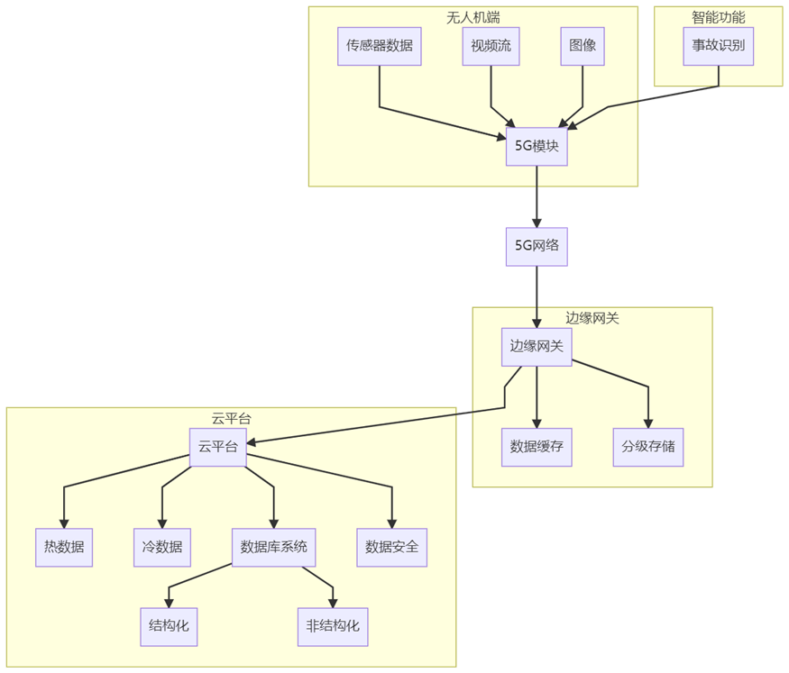

数据传输与存储小组负责本系统中无人机采集的事故图像、视频与传感器信息的实时高效传输及其在服务器端的存储与管理。本部分系统设计旨在确保无人机能够在高速公路复杂环境下，通过5G网络将事故现场数据快速、安全地传输至后端平台，并在服务器数据库中进行结构化存储，以支持事故预警、后续调度和数据分析等功能。

### **一、产品功能**

在产品功能方面，本系统首先支持无人机通过5G模块与边缘服务器或云平台进行高速数据上传。系统能够并发处理多种数据类型，包括视频流（RTSP/RTMP）、图像（JPEG/PNG）以及传感器数据（如GPS、IMU、温湿度等）。自动识别事故场景并触发数据传输任务，从而提高带宽利用率和数据的有效性。

此外，系统具备智能缓存与中断恢复能力。通过内置的数据缓存模块，在信号弱或传输中断时，系统能够暂时存储数据，待信号恢复后自动恢复传输，确保数据的完整性。特别是在不稳定的网络环境下，支持断点续传机制，可以在传输过程中丢失数据时，自动补发丢失的片段。

为了优化资源的利用，本系统采用分级存储管理策略。在边缘计算网关上，重要数据实时上传，而非关键数据会延时同步，确保资源得到合理分配。在后端服务器上，采用SSD存储热数据，HDD用于冷数据归档，从而提升存储效率和系统整体的性能。

后端数据库系统采用高可用架构，基于Linux服务器设计，使用MySQL进行结构化数据存储，MongoDB存储非结构化数据。此数据库架构不仅支持高速索引、关键词搜索，还能进行多维度数据查询，满足系统在高并发条件下的高效运作。

为了保障系统安全，所有传输的数据均使用TLS 1.3加密，确保数据在传输过程中不被窃取或篡改。系统还基于JWT技术进行用户鉴权与权限管理，确保数据访问的安全性。同时，定期备份和灾备机制的设计使得系统具备高可靠性和数据可恢复性。

图1：产品架构图

### **二、产品特点**

  在产品特点方面，本系统首先实现了低延迟传输。在5G网络支持下，端到端的传输延迟低于50毫秒，确保事故响应能够满足实时性要求。为进一步提高系统的稳定性，采用了双链路冗余设计（主5G链路和备Wi-Fi/4G链路），在主链路出现问题时，自动切换至备用链路，提升了系统的可靠性。

本系统还充分发挥边缘计算的优势，在无人机或边缘网关进行数据的预处理，减轻了后端服务器的压力。此外，系统的模块化设计使得传输模块和存储模块可以独立部署，支持多种类型的无人机接入，满足不同客户的需求。

在扩展性方面，系统具有较强的横向扩展能力，能够支持多台无人机的并发接入，适应全国范围内高速公路网的推广需求。

### **三、产品技术规格**

| 项目           | 参数/规格                        |
| -------------- | -------------------------------- |
| 无线通信协议   | 5G NR,  802.11ac, LTE fallback   |
| 最大传输速率   | 上行峰值100 Mbps，延迟＜200ms    |
| 支持协议       | TCP/UDP,  MQTT, RTMP, HTTP/HTTPS |
| 本地缓存容量   | 128GB SSD缓存模块（可扩展）      |
| 边缘处理芯片   | NVIDIA  Jetson Orin              |
| 后端服务器环境 | Linux  (Ubuntu 22.04 LTS)        |
| 数据库存储结构 | MySQL 8.0 +  MongoDB 6.0         |
| 安全机制       | TLS 1.3 加密、JWT鉴权            |
| 数据备份       | 每日增量备份 + 每周全备          |

### **四、产品研制**

本部分全面回顾了无人机车祸检测系统中“数据传输与存储模块”的研制全过程，涵盖从方案构想到产品定型的三个关键阶段：研发、试验与优化。该模块是保障系统高效、稳定运行的核心支撑，涉及多链路通信、边缘计算、数据管理等关键技术。

### 4.1 研发阶段

在系统研发初期，团队聚焦于技术选型、系统架构搭建及关键功能实现，以构建一套适应高速公路复杂通信环境的传输与存储体系。

  首先，在技术路线制定方面，团队综合评估了高速公路场景的特性，确定采用5G为主、4G/Wi-Fi为辅的多链路通信机制。这一方案能够在复杂的路况和弱信号区域中确保稳定传输。同时，选用了NVIDIA Jetson Orin作为智能前端处理设备，充分发挥其强大的边缘计算能力。后端则采用Linux + Docker的微服务架构，以支持快速部署与弹性扩展。

在系统架构与数据流设计阶段，我们构建了端-边-云三层结构：无人机采集， 边缘分析后台汇聚与存储。通过这一结构设计，能够在边缘计算设备上对数据进行初步处理，并保证数据的实时上传与后端存储。在数据流设计中，我们规划了从图像采集、帧压缩、异常识别到加密上传、数据入库的全过程，确保每个环节的数据都能得到及时处理与安全存储。此外，我们还设计了数据分层存储策略：结构化信息（如检测结果、GPS信息）存入MySQL数据库，而非结构化数据（如图像、视频）则存入MongoDB或对象存储，确保数据的高效存储与访问。

在核心模块开发方面，团队编写了Python/C++的数据采集与上传程序，将其集成到无人机的传感系统中。这些程序支持无人机在飞行过程中实时上传图像、视频及传感器数据。我们还开发了边缘计算模块，采用YOLO算法进行目标检测，实施帧筛选、图像压缩与打标签等功能，为后续的数据处理与分析提供基础。

最后，进行了一轮初步功能验证。在实验室中，我们模拟了不同网络环境下的端到端数据传输，并搭建了虚拟多无人机并发场景，评估了系统在大规模数据传输中的承载能力。通过自动化脚本测试，我们验证了系统在数据完整性、响应速度和模块稳定性方面的表现。

### 4.2 试验阶段

试验阶段聚焦于系统在真实高速公路场景下的实地部署与应用验证，重点测试通信稳定性、识别准确性与数据一致性。在这一阶段，团队的主要目标是确保系统能够在复杂的高速公路环境中稳定工作，满足事故检测和数据传输的实时性与可靠性要求。

首先，团队在选定的路段进行了边缘网关设备的安装，并与交通管理中心的网络进行联调。通过部署边缘网关设备，团队能够确保系统能够高效地与现有基础设施进行无缝连接。在这一过程中，团队还部署了多架无人机，进行定点和移动巡航任务，测试实际的数据传输效果。这些任务的完成为后续的性能评估提供了关键的实地数据。

其次，团队设置了假车祸现场，模拟事故场景，以检验系统在实际应用中的准确性和响应能力。通过这些模拟事故场景，系统能够有效识别并响应突发的事故情况。评估过程中，团队重点关注了图像传输的延迟、异常检测的响应时间以及信息同步的准确性，确保系统能够在紧急情况下迅速反应。

为了确保系统在各种网络环境下的适应性，团队还人工模拟了弱信号、掉线等网络波动场景。通过这些测试，团队验证了缓存和断点续传功能的有效性，确保在网络波动或中断的情况下，数据能够准确传输并恢复。同时，团队测试了不同通信链路间的无缝切换能力，确保系统能够在5G、4G和Wi-Fi等不同网络之间自动切换，保持稳定的通信。

在试验阶段的最后，团队进行了全面的系统评估。实测了系统在不同条件下的传输带宽、延迟和帧丢失率等关键性能指标，评估了系统的整体稳定性和性能。此外，团队还邀请了交通执法人员参与试用，收集了他们的功能体验与操作反馈。通过这些用户反馈，团队能够识别出系统的不足之处，并整理出一份详细的优化清单，为后续的优化阶段提供了宝贵的改进依据。

### 4.3 优化阶段

在完成实地试验并收集大量现场数据和用户反馈之后，系统进入了优化阶段。本阶段聚焦于系统在传输性能、可靠性、安全性以及可扩展性等方面的全面提升，确保其在更大范围的部署中依然能够保持稳定、高效的运行状态。

为缓解网络带宽压力、提升传输效率，开发团队在传输性能方面进行了关键优化。原有的视频编码方式由 H.264 升级为压缩效率更高的 H.265，大幅降低了数据传输所需的带宽资源。此外，系统引入了 Kafka 消息队列，对高频数据流进行异步分发和解耦处理，显著提升了整体的数据处理吞吐量。同时，为了确保关键事件能够优先上传，帧筛选算法也经过优化调整，实现对事故图像、车辆异常行为等内容的自动识别与优先上传。

在可靠性方面，团队进一步完善了容错机制。系统新增通信链路备选通道功能，能够在主链路失效时自动切换至备用网络，如4G或Wi-Fi，保障传输不中断。同时，针对复杂网络条件下的稳定性问题，缓存机制与断点续传逻辑被重构，使得系统在面临信号波动、短时中断等异常时仍能保持数据的完整性与连续性。

系统的安全性与运维便捷性也在此阶段得到了显著强化。数据传输全面启用TLS 1.3加密协议，防止数据在传输过程中被窃取或篡改；服务器端部署了多层安全防护措施，包括防火墙、安全审计与异常日志记录模块，有效提高系统抗攻击能力。与此同时，为了简化部署流程与日常维护，开发团队构建了可视化运维界面，使技术人员能够更直观地监控系统状态、调试故障和管理任务。

最后，为支持不同环境和设备的部署需求，系统在兼容性和通用性方面也做了重要拓展。团队针对不同厂商的无人机平台设计了统一的兼容层，确保多品牌、多型号设备能够无缝接入。同时，系统架构中预留了适配接口，以便未来可快速对接各类道路场景与交通管理系统，为后续在全国高速路网的推广部署打下技术基础。在完成实地试验并收集大量现场数据和用户反馈之后，系统进入了优化阶段。本阶段聚焦于系统在传输性能、可靠性、安全性以及可扩展性等方面的全面提升，确保其在更大范围的部署中依然能够保持稳定、高效的运行状态。

为缓解网络带宽压力、提升传输效率，开发团队在传输性能方面进行了关键优化。原有的视频编码方式由 H.264 升级为压缩效率更高的 H.265，大幅降低了数据传输所需的带宽资源。此外，系统引入了 Kafka 消息队列，对高频数据流进行异步分发和解耦处理，显著提升了整体的数据处理吞吐量。同时，为了确保关键事件能够优先上传，帧筛选算法也经过优化调整，实现对事故图像、车辆异常行为等内容的自动识别与优先上传。

在可靠性方面，团队进一步完善了容错机制。系统新增通信链路备选通道功能，能够在主链路失效时自动切换至备用网络，如4G或Wi-Fi，保障传输不中断。同时，针对复杂网络条件下的稳定性问题，缓存机制与断点续传逻辑被重构，使得系统在面临信号波动、短时中断等异常时仍能保持数据的完整性与连续性。

系统的安全性与运维便捷性也在此阶段得到了显著强化。数据传输全面启用TLS 1.3加密协议，防止数据在传输过程中被窃取或篡改；服务器端部署了多层安全防护措施，包括防火墙、安全审计与异常日志记录模块，有效提高系统抗攻击能力。与此同时，为了简化部署流程与日常维护，开发团队构建了可视化运维界面，使技术人员能够更直观地监控系统状态、调试故障和管理任务。

最后，为支持不同环境和设备的部署需求，系统在兼容性和通用性方面也做了重要拓展。团队针对不同厂商的无人机平台设计了统一的兼容层，确保多品牌、多型号设备能够无缝接入。同时，系统架构中预留了适配接口，以便未来可快速对接各类道路场景与交通管理系统，为后续在全国高速路网的推广部署打下技术基础。									

### **五、产品测试**

本部分对数据传输与存储模块的测试情况进行系统总结。测试内容涵盖主要功能模块、核心业务流程，全面评估了产品在多种网络和使用场景下的表现，并识别出可能影响系统稳定性和安全性的潜在风险。最终结合测试结果，提出上线建议。

### 5.1 测试涵盖内容

本次测试围绕数据传输与存储模块展开，测试内容涵盖功能验证、关键模块评估及完整业务流程回溯，确保系统在复杂高速公路环境下的实际可用性与稳定性。在功能测试方面，团队重点验证了无人机图像与视频的实时上传能力，包括图像压缩与编码准确性，并重点测试系统对 H.265 编码格式的支持。同时，对传感器数据的同步传输也进行了测试，确保 GPS 坐标、速度和姿态信息与图像在时间戳上的一致性。此外，还通过模拟断网情境，验证了本地缓存与断点续传机制的可靠性，并在多机并发上传场景下进行了压力测试，评估系统负载能力。

模块测试方面，重点对边缘计算、通信链路和数据库模块进行了专项验证。边缘端的图像筛选、打标签及数据预处理能力得到了效率评估，通信模块则通过5G信号强度切换与丢包重传测试，验证了网络适应能力。数据库部分涵盖了 MySQL 与 MongoDB 在写入、查询与备份方面的性能测试，此外还进行了异常输入与数据完整性校验，确保数据在后端的持久化安全。

完整业务流程测试从车祸事件发生、数据上传、服务器接收与入库，再到事故可视化展示与用户查询响应全过程进行了跟踪验证。同时，也测试了不同权限用户对数据访问的限制效果与前端响应时间，确保系统端到端的完整性与用户体验。

### 5.2 测试结果

在测试过程中，团队识别出若干潜在风险点，对其可能影响系统稳定性的方面进行了逐一分析与应对建议。首先是在部分高速边远路段，5G 信号存在覆盖盲区，可能导致数据实时上传中断。对此，建议通过增强本地缓存能力、部署中继基站或引入混合通信（如 LTE、Wi-Fi）方式进行补充。其次，当多台无人机并发上传时，服务器出现写入延迟现象，存在一定的高并发瓶颈风险，建议在后端引入负载均衡机制并通过数据库分片优化写入效率。

另外，尽管断点续传机制在多数场景下表现稳定，但在极端网络抖动条件下，存在个别数据丢失的可能，建议进一步优化分包策略和补传算法，增强容错能力。权限管理方面，系统目前采用命令行配置权限规则，技术门槛较高，存在配置失误或误删数据的风险，因此建议开发图形化权限管理界面，并对操作人员进行必要培训。

### 5.3 潜在风险与上线建议

综合多轮测试结果，数据传输与存储模块已具备上线条件。系统各核心功能稳定，支持多类型数据高效上传与存储，业务流程完整、响应快速，能够满足车祸事件响应系统的基本需求。虽然系统在信号弱场景与高并发处理方面仍存在一定改进空间，但目前已具备相应的补救与优化机制。建议在选定的高速交通枢纽路段开展小范围试点部署，持续收集运行数据并动态优化系统表现。在确保系统表现稳定、用户反馈积极的前提下，可逐步扩大部署范围，实现全线推广。

 
